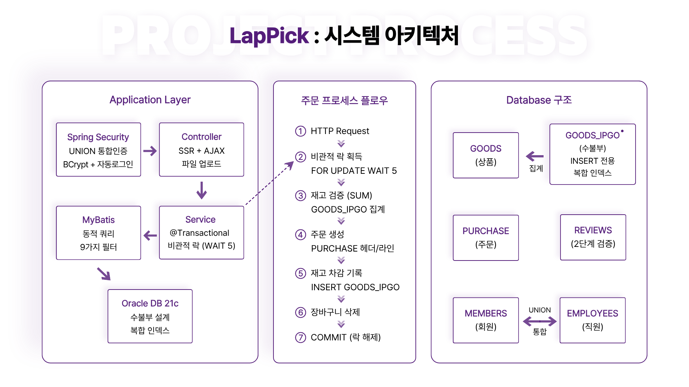

# LapPick

간단한 5가지 필터로 노트북을 쉽게 찾을 수 있는 쇼핑몰입니다.  
깔끔한 UI와 직관적인 UX로 누구나 편하게 사용할 수 있도록 했습니다.

**개발 기간:** 2025.08.12 ~ 2025.11.08 (1인 프로젝트)

---

## 왜 만들었나

요즘 노트북 쇼핑몰에 들어가면 필터가 너무 많습니다.  
CPU 종류, RAM 용량, SSD 용량, GPU 모델, 화면 해상도, 주사율...

선택지가 수십 개나 되니까 초보 사용자는 선택하기도 전에 지쳐버립니다.

스펙도 중요하지만, 너무 많은 선택지는 오히려 선택을 어렵게 만든다고 판단해  
필터를 5가지로 줄이고 입력도 간편하게 만들어  
누구나 쉽게 노트북을 찾을 수 있는 쇼핑몰을 만들고 싶었습니다.

---

## 주요 기능


*LapPick 시스템 구조 및 주문 프로세스 플로우*

### 1. 상품 필터 (5가지만)

1. 브랜드 (9개 체크박스)  
   SAMSUNG, LG, APPLE, MSI, ASUS, LENOVO, MICROSOFT, HP, HANSUNG

2. 용도 (3개 체크박스)  
   - 사무용: 문서 작업, 인터넷 검색
   - 게임용: 고사양 게임
   - 영상편집: 영상 작업, 그래픽 디자인

3. 가격 (범위 입력)  
   만원 단위 입력 (예: 150 ~ 300 → 150만원 ~ 300만원)

4. 스크린 (범위 입력)  
   인치 단위 (예: 13.3 ~ 17.3)  
   편의 기능: 156 입력 → 15.6 자동 변환

5. 무게 (범위 입력)  
   kg 단위 (예: 1.0 ~ 1.7)  
   편의 기능: 125 입력 → 1.25 자동 변환

**동적 쿼리:**

MyBatis 동적 쿼리로 사용자가 선택한 필터만 WHERE 조건에 추가.  
5가지 필터의 모든 조합을 하나의 쿼리로 처리.

---

### 2. 수불부 기반 재고 관리

회계의 수불부 방식을 적용하여 모든 재고 변동을 INSERT로만 기록:
- 입고 +100, 주문 -1, 취소 +1 형태로 이력 누적
- SUM(IPGO_QTY)로 현재 재고 계산
- 복합 인덱스 (GOODS_NUM, IPGO_QTY)로 재고 집계 조회 최적화 (테스트 기준 Cost 98.7% 감소)

장점:
- 재고 변동 이력 완전 추적
- UPDATE 없어 동시성 충돌 감소
- 문제 발생 시 원인 추적 가능

상세 설계: [어려웠던 점 - 수불부 설계](#2-수불부-설계-결정) 참고

---

### 3. 장바구니

Oracle MERGE 문으로 "있으면 수량 증가 / 없으면 추가"를 한 쿼리로 처리.
- 2번의 DB 호출(SELECT + INSERT/UPDATE)을 1번으로 감소

---

### 4. 통합 인증 시스템

UNION ALL로 회원/관리자 테이블을 병합하여 단일 인증 플로우로 처리.
- grade 필드로 권한 자동 부여 (ROLE_MEMBER / ROLE_EMPLOYEE)
- Spring Security URL 기반 접근 제어
- 타입 선택 불필요 (UX 개선)
- 인증 로직 중복 제거

상세 구현: [기술적 의사결정 - 통합 인증](#회원관리자-통합-인증) 참고

---

### 5. 주문 프로세스

FOR UPDATE 비관적 락으로 동시성 제어:
1. 상품 락 획득 (FOR UPDATE WAIT 5)
2. 재고 확인 → 주문 생성 → 재고 차감 → 장바구니 삭제
3. 트랜잭션으로 원자성 보장

주문 상태: 결제완료 → 상품준비중 → 배송중 → 배송완료  
주문 취소 시 재고 자동 복구

상세 해결 과정: [어려웠던 점 - 동시성 문제](#1-동시성-문제-발견-및-해결) 참고

---

### 6. 리뷰 시스템

- 배송완료 상태에서만 작성 가능
- 1개 주문당 1개 리뷰만 작성 가능
- 별점 1~5점, 이미지 여러 장 업로드
- 관리자 리뷰 숨김/삭제 기능

**중복 리뷰 방지 (2단계):**
1. 서버: COUNT 검증으로 사전 차단
2. DB: UNIQUE 제약 (PURCHASE_NUM, GOODS_NUM)으로 Race Condition 차단

배송완료 + 본인 구매 + 중복 방지 로직은 서버와 DB 양쪽에서 보장.

---

### 7. 판매 통계 (관리자)

상품별 판매 현황 집계:
- 총 판매 수량 / 매출액 / 리뷰 수 / 평균 별점
- 판매량/매출액/리뷰/평점 정렬

재입고 결정, 프로모션 선정 등에 활용.

### 8. 공통 UX 개선

- 페이지 이동 시 스크롤 위치 유지 (상품 목록, 리뷰, 주문 내역 등 - sessionStorage)

---

## 기술 스택

Backend
- Spring Boot 3.4.0
- MyBatis 3.0.3
- Oracle 21c
- Spring Security 6

Frontend
- Thymeleaf
- jQuery/AJAX
- 다음 주소 API

Testing
- JUnit 5 + Mockito, Spring Security Test + MockMvc (테스트 코드 64개, 11개 파일)
- JMeter 5.6.3 (100명 동시성 부하 테스트)
- EXPLAIN PLAN (커버링 인덱스 성능 검증)

---

## 프로젝트 구조
```
LapPick/
├── src/main/java/lappick/
│   ├── purchase/
│   │   └── PurchaseService.java     # 비관적 락 주문 처리
│   ├── goods/
│   │   └── GoodsService.java        # 수불부 재고 관리
│   ├── auth/
│   │   └── AuthMapper.xml           # UNION ALL 기반 통합 인증 조회
│   ├── config/
│   │   ├── SecurityConfig.java      # Spring Security 설정
│   │   └── WebConfig.java
│   ├── cart/, review/, member/, admin/
│   ├── qna/                         # 1:1 문의
│   └── common/
│       └── util/SensitiveDataMasker.java  # 주민번호/카드번호 마스킹
├── src/main/resources/
│   ├── mappers/
│   │   ├── GoodsMapper.xml          # FOR UPDATE, 동적 필터
│   │   ├── CartMapper.xml           # MERGE 문
│   │   ├── AuthMapper.xml           # UNION ALL
│   │   └── PurchaseMapper.xml
│   ├── static/
│   └── templates/
├── src/test/java/lappick/ 			 # 테스트 코드 64개 (11개 파일)
├── config/
│   └── application-secrets.example.properties
├── tools/mailpit/                   # 로컬 메일 샌드박스
├── docs/
│   ├── images/
│   ├── 비관적_락_동시성_테스트.pdf
│   ├── 복합_인덱스_성능_테스트.pdf
│   └── Eclipse_Blocking_검증.pdf
└── pom.xml
```

**핵심 파일:**
- `PurchaseService.java`: 비관적 락 기반 주문 처리
- `GoodsMapper.xml`: SELECT FOR UPDATE + 동적 필터
- `CartMapper.xml`: Oracle MERGE 문 활용
- `AuthMapper.xml`: UNION ALL 통합 인증

---

## 실행 방법

1. 데이터베이스 설정
```sql
CREATE USER LAPPICK IDENTIFIED BY yourpassword;
GRANT CONNECT, RESOURCE TO LAPPICK;
```

2. 로컬 설정 파일 생성  
`config/application-secrets.example.properties`를 복사해서  
`config/application-secrets.properties`로 저장하고 값 채우기:
```properties
file.upload.dir=C:/your/upload/path/
spring.datasource.password=yourpassword
```

3. (선택) 로컬 메일 샌드박스 실행  
임시 비밀번호 발송 기능을 로컬에서 확인하려면:
```powershell
powershell -ExecutionPolicy Bypass -File .\tools\mailpit\start-mailpit.ps1
```
수신함: http://127.0.0.1:8025

4. 실행
```bash
mvn spring-boot:run
```

5. 접속
```
http://localhost:8080
```

일반 회원으로 로그인하면 장바구니 아이콘이 보이고,  
관리자로 로그인하면 장바구니 아이콘이 톱니바퀴로 바뀝니다.

---

## 성능 테스트 결과

### JMeter 동시성 테스트

재고 1개 남은 상품에 100명이 동시 주문했을 때:

| 구분 | 비관적 락 X | 비관적 락 O |
|------|------------|------------|
| 주문 성공 | 11명 | 1명 |
| 재고 결과 | -10 | 0 |
| 평균 응답 시간 | 88ms | 380ms |


*왼쪽(비관적 락 X): 재고 -10, 11명 주문 성공 | 오른쪽(비관적 락 O): 재고 0, 1명만 주문 성공*

상세 테스트: [비관적_락_동시성_테스트.pdf](docs/비관적_락_동시성_테스트.pdf)

성능은 약 4.3배 느려졌지만, 쇼핑몰에서 오버셀링과 같은 금전적인 오류는  
치명적이므로 허용 가능한 범위 내에서 정합성을 택했습니다.

---

## 리팩토링 내역

프로젝트를 완성하고 코드를 다시 보니까 개선할 부분이 많이 보였습니다.

### 1. 동시성 제어 강화

- `@Transactional` 명시적 설정 (timeout=10, isolation=READ_COMMITTED)
- FOR UPDATE 도입
- 예외 처리 세분화 (CannotAcquireLockException / IllegalStateException)

### 2. 로깅 시스템 개선

- System.out.println → Logger 전환
- 로그 레벨 구분 (INFO/ERROR)

초기에는 System.out으로 출력했는데,  
나중에 찾아보니 로그 레벨 제어가 안 되고 성능에도 영향을 준다는 걸 알게 됐습니다.

### 3. 보안

기능을 완성하고 나서 보안 쪽을 다시 봤더니 기본적인 부분이 빠져있었습니다.

가장 눈에 띄었던 건 CSRF였습니다. 처음엔 `csrf.disable()`로 그냥 꺼뒀는데,  
이 상태에서 사용자가 다른 사이트에서 폼을 제출하면 막을 방법이 없었습니다.  
`CookieCsrfTokenRepository`를 적용하고, jQuery 전역 인터셉터로 AJAX 요청마다  
자동으로 토큰을 붙이도록 했습니다.

삭제 요청도 GET으로 처리하던 걸 POST로 바꿨습니다.  
GET 요청은 CSRF 보호 대상이 아니라서 링크만 클릭해도 삭제가 됐습니다.

`returnUrl` 파라미터도 그냥 redirect에 붙여쓰던 걸 외부 URL은 차단하도록 수정했습니다.  
`https://evil.example` 같은 값이 들어와도 `/admin/qna`로 돌아가게 했습니다.

### 4. 개인정보 처리

직원 주민번호가 원문 그대로 DB에 저장되고 있었습니다.

`SensitiveDataMasker` 유틸리티 클래스를 만들어서  
저장할 때 `900101-1234567` → `900101-1******` 형태로 마스킹하고,  
편집 폼에도 원문 대신 마스킹된 값을 표시하도록 했습니다.  
수정할 때 주민번호 칸을 비워두면 기존 값을 그대로 유지합니다.

카드번호도 같은 방식으로 처리했습니다. 주문 저장 시 마스킹하고,  
주문 상세 조회 때도 마스킹된 값을 보여줍니다.

다만 마스킹 저장은 원본 복원이 안 된다는 한계가 있어서,  
운영 환경이라면 AES 암호화 저장이 더 맞는 방향일 것 같습니다.

### 5. DB 무결성

기능 구현에 집중하다 보니 DB 레벨 제약이 많이 빠져있었습니다.

아이디와 이메일 중복을 서비스 코드에서만 체크하고 있었는데,  
동시 요청이 오면 둘 다 통과할 수 있는 구조였습니다.  
MEMBERS, EMPLOYEES 테이블에 Unique 제약을 추가해서 DB 레벨에서도 막았습니다.

FK도 빠진 게 많았습니다. CART → GOODS, GOODS → EMPLOYEES 등 5개를 추가했고,  
QNA → MEMBERS FK에도 ON DELETE CASCADE가 없어서 추가했습니다.  
이게 없으면 회원 삭제 시 FK 위반 에러가 나거나, 서비스 코드에서 순서를 맞춰야 합니다.

`cart_qty > 0`, `review_rating BETWEEN 1 AND 5` 같은 비즈니스 규칙도  
CHECK 제약으로 DB에 추가했습니다. 서비스 코드가 우회돼도 잘못된 값이 들어가지 않습니다.

### 6. 회원 탈퇴 처리

탈퇴가 물리 DELETE였습니다.  
탈퇴한 회원의 주문 이력이 남아있는데 회원 정보가 사라지면 데이터가 깨집니다.

MEMBERS 테이블에 `MEMBER_STATUS`, `MEMBER_WITHDRAWN_AT` 컬럼을 추가하고,  
탈퇴 시에는 삭제 대신 상태를 WITHDRAWN으로 바꾸도록 수정했습니다.  
MEMBER_ID도 `withdrawn_{memberNum}` 형식으로 변경해서 재가입 시 중복을 피했습니다.

### 7. 채번 방식

직원 번호, 상품 번호, 회원 번호를 `MAX(col)+1`로 채번하고 있었는데,  
동시 요청이 오면 같은 번호가 두 번 나올 수 있는 구조였습니다.

핵심 채번 경로를 Oracle Sequence 기반으로 전환했습니다.  
(`EMP_NUM_SEQ`, `GOODS_NUM_SEQ`, `MEMBER_NUM_SEQ`)

### 8. 테스트 코드

기능 구현이 끝나고 나서 리팩토링을 진행했는데,  
"이 코드를 바꿔도 다른 곳이 안 깨지는지"를 확인할 방법이 없었습니다.

JUnit 5 + Mockito 기반 단위 테스트와 Spring Security Test + MockMvc 기반 보안 테스트를 작성했습니다. (11개 파일, 64개 케이스)
주요 케이스는 비관적 락 타임아웃 처리, 재고 부족 차단, 중복 체크,  
소프트 딜리트 흐름, Open Redirect 차단 등입니다.

MockMvc + SecurityConfig를 임포트해서 실제 CSRF 필터가 동작하는 환경에서  
Security 관련 동작도 테스트했습니다.

---

## 어려웠던 점과 해결 과정

### 1. 동시성 문제 발견 및 해결

#### 문제 상황

쇼핑몰 기능 구현을 완료하고 JMeter로 부하 테스트를 했을 때  
동시성 문제를 발견했습니다.
```java
// 비관적 락 없이 재고 처리 (문제 코드)
int stock = goodsMapper.getStock(goodsNum);  // 1. 재고 조회
if (stock > 0) {
    purchaseMapper.insert(...);              // 2. 주문 생성
    goodsMapper.updateStock(goodsNum, -1);   // 3. 재고 차감
}
```

**문제점:** 1번과 3번 사이에 다른 요청이 끼어들 수 있음

**JMeter 테스트 결과 (비관적 락 X):**
- 재고 1개 상품에 100명 동시 주문
- 결과: 11명 주문 성공, 재고 -10

---

#### 해결 방법

FOR UPDATE 비관적 락을 적용했습니다.
```java
@Transactional(
    propagation = Propagation.REQUIRED,
    isolation = Isolation.READ_COMMITTED,
    timeout = 10,
    rollbackFor = Exception.class
)
public String placeOrder(...) {
    // 1. 락 획득
    try {
        goodsMapper.selectGoodsForUpdate(goodsNum);
        log.debug("락 획득 성공: {}", goodsNum);
    } catch (Exception e) {
        throw new CannotAcquireLockException(
            "다른 사용자가 주문 중입니다. 잠시 후 다시 시도해주세요.", e
        );
    }
    
    // 2. 안전하게 재고 확인 및 차감
    int stock = goodsMapper.getStock(goodsNum);
    if (stock < quantity) {
        throw new IllegalStateException("재고 부족");
    }
    
    // 3. 주문 생성 및 재고 차감
    purchaseMapper.insert(...);
    goodsService.changeStock(goodsNum, -quantity, "주문");
}
```

`changeStock()` 메서드도 `Propagation.REQUIRED`로 설정되어 있어,  
`placeOrder()`의 트랜잭션에 참여합니다.

```java
@Transactional(propagation = Propagation.REQUIRED)
public void changeStock(String goodsNum, int qty, String memo) {
    // placeOrder 트랜잭션과 통합 실행
}
```

**효과:**
- 주문 생성 실패 시 → 재고 차감도 롤백
- 재고 차감 실패 시 → 주문 생성도 롤백
- 데이터 정합성 보장

```sql
-- GoodsMapper.xml
SELECT GOODS_NUM FROM GOODS 
WHERE GOODS_NUM = #{goodsNum} 
FOR UPDATE WAIT 5
```

**JMeter 테스트 결과 (비관적 락 O):**
- 재고 1개 상품에 100명 동시 주문
- 결과: 1명 주문 성공, 재고 0

**트레이드오프:**
- 성능: 88ms → 380ms (4.3배 저하)
- 정합성: 재고 -10 → 0 (오버셀링 완전 차단)

→ 쇼핑몰에서 오버셀링은 금전적 손실로 이어지므로 성능 저하를 감수하고 비관적 락 선택

상세 검증: [비관적_락_동시성_테스트.pdf](docs/비관적_락_동시성_테스트.pdf)

---

#### Eclipse Debugger 검증

처음에는 "이게 정말 동작하나?" 확신이 안 섰습니다.  
그래서 Eclipse Debugger로 직접 확인했습니다.

**검증 시나리오:**
1. User A가 주문 시작 (Breakpoint로 멈춤)
2. User B가 같은 상품 주문 시도
3. User B 브라우저가 무한 로딩 → Lock 대기 중 ✅
4. User A Resume → 주문 완료
5. User B 진행 → 재고 부족으로 실패 ✅

실제로 Lock이 동작하는 것을 눈으로 확인하고 나서야 확신할 수 있었습니다.


*User A Breakpoint 실행 → User B Lock 대기 → User A 완료 → User B 진행*

상세 검증: [Eclipse_Blocking_검증.pdf](docs/Eclipse_Blocking_검증.pdf)

---

### 2. 수불부 설계 결정

처음에는 GOODS 테이블에 STOCK 컬럼을 두려고 했습니다.

```sql
-- 처음 생각한 구조
GOODS (
    GOODS_NUM,
    STOCK INT  -- 현재 재고
)
```

근데 이렇게 하면 "재고가 왜 마이너스가 됐지?" 같은 문제가 생겼을 때  
원인을 추적할 방법이 없었습니다.

회계에서 쓰는 수불부 개념을 찾아보니,  
모든 입출고를 기록으로 남기고 합계로 재고를 계산하는 방식이었습니다.

```sql
-- 수불부 방식
GOODS_IPGO (
    IPGO_NUM,
    GOODS_NUM,
    IPGO_QTY INT,  -- +100 (입고) / -1 (주문) / +1 (취소)
    IPGO_DATE
)

-- 현재 재고 = SUM(IPGO_QTY)
```

이렇게 하니 모든 재고 변동 이력이 남았고,  
나중에 문제가 생겨도 추적할 수 있게 됐습니다.

대신 매번 SUM을 계산해야 해서 느릴 수 있는데,  
복합 인덱스 (GOODS_NUM, IPGO_QTY)로 해결했습니다.

성능 테스트를 위해 GOODS_IPGO와 동일 구조의 TEST_GOODS_IPGO에  
100만 건 더미 데이터(상품 200개 × 5,000건 수불부 이력)를 넣고,  
100회 반복 실행 총합과 EXPLAIN PLAN을 함께 확인했습니다.

그 결과 Cost는 1,654 → 22로 감소했고,  
100회 실행 총합은 16,700ms → 30ms였습니다.  
회당 평균으로 환산하면 167ms → 0.3ms입니다.

실행 계획 (인덱스 없음):
```
Cost: 1,654
Operation: TABLE ACCESS FULL
Predicate: filter("GOODS_NUM"='goods_000001')
```

실행 계획 (인덱스 있음):
```
Cost: 22
Operation: INDEX RANGE SCAN
Predicate: access("GOODS_NUM"='goods_000001')
```

테이블 접근이 사라졌고, Predicate도 filter() → access()로 바뀌어  
조건 컬럼을 인덱스 탐색에 직접 활용하는 형태로 개선됐습니다.  
또한 SUM 대상 컬럼(IPGO_QTY)까지 인덱스에 포함되어  
인덱스만으로 집계가 가능함을 확인했습니다.

실제 데이터는 85건 정도지만, 데이터가 많이 쌓였을 때를 대비해서  
복합 인덱스를 미리 만들어뒀습니다.

상세 분석: [복합_인덱스_성능_테스트.pdf](docs/복합_인덱스_성능_테스트.pdf)

---

### 3. 예외 처리 세분화

처음에는 모든 예외를 `Exception`으로 잡아서 처리했습니다.

```java
} catch (Exception e) {
    log.error("주문 처리 중 오류", e);
    return "error";
}
```

근데 이렇게 하면 락 타임아웃인지, 재고 부족인지, 시스템 에러인지  
사용자에게 구체적으로 알려줄 수가 없었습니다.

그래서 예외를 세분화했습니다.

```java
try {
    goodsMapper.selectGoodsForUpdate(goodsNum);
} catch (Exception e) {
    throw new CannotAcquireLockException(
        "다른 사용자가 주문 중입니다. 잠시 후 다시 시도해주세요.", e
    );
}

if (stock < quantity) {
    throw new IllegalStateException(
        String.format("상품명: '%s' 재고가 부족합니다. (주문수량: %d, 현재재고: %d)", 
            goodsName, quantity, stock)
    );
}
```

이렇게 하니 사용자는 구체적인 오류 메시지를 보고,  
개발자는 로그로 원인을 빠르게 파악할 수 있게 됐습니다.

---

## 기술적 의사결정

### JPA 대신 MyBatis

상황:  
이 프로젝트는 복잡한 쿼리가 많았습니다.
- 재고 수불부 SUM 집계
- 주문 내역 4-5개 테이블 조인
- 5가지 필터 조건 동적 조합 (브랜드는 9개 옵션 중 복수 선택)

결정:  
JPA로도 할 수 있지만 JPQL이나 Criteria API가 복잡해질 것 같아서  
SQL을 직접 제어할 수 있는 MyBatis를 선택했습니다.

EXPLAIN PLAN으로 쿼리 성능을 직접 확인하고 튜닝할 수 있어서 좋았습니다.

---

### 낙관적 락 vs 비관적 락

재고는 금전과 직결되어 단 1건의 오차도 허용할 수 없습니다.

| 방식 | 성능 | 정합성 | 선택 |
|------|------|--------|------|
| 낙관적 락 | 빠름 | 재시도 필요 | X |
| 비관적 락 | 느림 | 보장됨 | O |

낙관적 락은 충돌 발생 시 롤백하고 재시도해야 하는데,  
동시 주문이 많으면 재시도가 폭증할 것 같았습니다.

비관적 락은 대기 시간이 발생하지만 (88ms → 380ms),  
재고 정합성을 확실하게 보장할 수 있어서 선택했습니다.

---

### 회원/관리자 통합 인증

상황:  
MEMBERS 테이블과 EMPLOYEES 테이블이 분리되어 있어서  
인증 로직을 두 번 만들어야 할 것 같았습니다.

결정:  
SQL UNION ALL로 두 테이블을 합쳐서 단일 인증 객체를 만들었습니다.

```sql
SELECT 
    MEMBER_ID AS userId, MEMBER_PW AS userPw, 
    MEMBER_NAME AS userName, MEMBER_EMAIL AS userEmail, 
    'mem' AS grade
FROM MEMBERS
WHERE MEMBER_ID = #{userId}
UNION ALL
SELECT 
    EMP_ID AS userId, EMP_PW AS userPw, 
    EMP_NAME AS userName, EMP_EMAIL AS userEmail, 
    'emp' AS grade
FROM EMPLOYEES
WHERE EMP_ID = #{userId}
```

이렇게 하니 Spring Security 설정을 하나만 만들면 됐고,  
인증 로직 수정도 한 곳에서만 하면 됐습니다.

---

### LEFT JOIN으로 N+1 해결

상황:  
상품 목록을 조회할 때 상품마다 재고, 리뷰, 판매량을 개별 조회하면 N+1 문제가 발생합니다.
- 상품 100개 → 쿼리 301회 (1 + 100 + 100 + 100)

해결:  
LEFT JOIN과 서브쿼리로 모든 정보를 한 번에 조회합니다.

```sql
SELECT G.*, 
       COALESCE(S.STOCK_QTY, 0) AS STOCK_QTY,
       COALESCE(R.REVIEW_COUNT, 0) AS REVIEW_COUNT,
       COALESCE(PL.TOTAL_SOLD, 0) AS TOTAL_SOLD
FROM GOODS G
LEFT JOIN (SELECT GOODS_NUM, SUM(IPGO_QTY) AS STOCK_QTY 
           FROM GOODS_IPGO GROUP BY GOODS_NUM) S 
    ON G.GOODS_NUM = S.GOODS_NUM
LEFT JOIN (SELECT GOODS_NUM, COUNT(*) AS REVIEW_COUNT 
           FROM REVIEWS WHERE REVIEW_STATUS = 'PUBLISHED' 
           GROUP BY GOODS_NUM) R 
    ON G.GOODS_NUM = R.GOODS_NUM
LEFT JOIN (SELECT GOODS_NUM, SUM(PURCHASE_QTY) AS TOTAL_SOLD 
           FROM PURCHASE_LIST GROUP BY GOODS_NUM) PL
    ON G.GOODS_NUM = PL.GOODS_NUM
```

결과:
- 상품 100개 → 쿼리 1회
- N+1 문제 사전 방지

---

## 배운 점

### 1. 성능 측정의 중요성

"비관적 락을 쓰면 느려지겠지"라고 생각했는데,  
실제로 측정해보니 88ms → 380ms로 약 4.3배 정도 느려졌습니다.

예상보다는 느렸지만 허용 가능한 범위였습니다.

JMeter로 부하 테스트를 돌려보고,  
EXPLAIN PLAN으로 쿼리 성능을 확인하고,  
Eclipse Debugger로 Lock 동작을 눈으로 검증했습니다.

막연한 걱정보다 실제 측정이 중요하다는 걸 배웠습니다.

---

### 2. 복합 인덱스의 Covering Index 효과

인덱스는 WHERE 절만 빠르게 하는 줄 알았는데,  
SELECT 절까지 고려하면 더 빠를 수 있다는 걸 배웠습니다.

```sql
-- 인덱스: (GOODS_NUM, IPGO_QTY)
SELECT SUM(IPGO_QTY) FROM GOODS_IPGO WHERE GOODS_NUM = ?
```

이 쿼리는 인덱스만으로 처리가 가능해서 테이블 접근이 필요 없습니다.  
(GOODS_NUM으로 찾고, IPGO_QTY는 이미 인덱스에 포함되어 있기 때문)

EXPLAIN PLAN 기준 Cost가 1,654 → 22로 감소했고, 100회 실행 총합은 16,700ms → 30ms였습니다.  
회당 평균으로 환산하면 167ms → 0.3ms 수준이었고, Predicate도 filter() → access()로 바뀌어  
인덱스 탐색 방식이 더 효율적으로 개선됐습니다.

"어떤 컬럼을 인덱스에 넣을까"를 고민할 때  
WHERE 절만 보는 게 아니라 SELECT, ORDER BY까지 고려해야 한다는 걸 배웠습니다.

---

### 3. 테스트 코드가 없으면 리팩토링이 아니라 도박이다

리팩토링하면서 가장 크게 느낀 점입니다.

소프트 딜리트를 구현할 때 `deleteMemberById()`를 `softWithdrawMember()`로 바꿔야 했는데,  
이게 다른 곳에서 호출되고 있는지, 바꿨을 때 뭔가 깨지는지를  
확인하려면 직접 실행해서 눈으로 보는 수밖에 없었습니다.

핵심 흐름에 대한 테스트를 먼저 보강하고 나서 수정했더니 달랐습니다.
ArgumentCaptor로 실제 DB에 넘어가는 값을 검증하고,  
`verify(memberMapper, never()).deleteMemberById(any())`처럼  
"이건 절대 호출되면 안 된다"를 코드로 명시할 수 있었습니다.

테스트가 없을 때는 "아마 괜찮겠지"로 배포했다면,  
테스트가 있으니까 "이 조건에서는 확실히 동작한다"고 말할 수 있게 됐습니다.

---

### 4. 기능이 돌아간다고 끝이 아니다

기능 구현할 때는 "돌아가게" 만드는 데 급급했습니다.

근데 리팩토링하면서 보니까 CSRF가 꺼져있고, FK가 빠져있고,  
중복 체크가 Race Condition에 노출돼 있었습니다.  
기능은 잘 돌아가는데 보안이나 데이터 무결성은 구멍이 뚫려있었던 거죠.

기능 동작과 운영 가능한 코드는 다르다는 걸 이번에 제대로 배웠습니다.

---

## 남은 개선 여지

| 항목 | 현재 상태 | 개선 방향 |
|------|-----------|-----------|
| 주민번호 저장 | 마스킹 저장 (원본 복원 불가) | 미수집 or AES 양방향 암호화 |
| 페이지네이션 로직 | 서비스마다 중복 구현 | PageData\<T\> 제네릭으로 통일 |
| 동시성 통합 테스트 | JMeter 수동 검증 | @SpringBootTest + ExecutorService 자동화 |
| IPGO_NUM 타입 | VARCHAR2(50) — 문자 정렬 오류 가능 | NUMBER로 변경 |

---

### 정량적 개선

| 지표 | Before | After |
|------|--------|-------|
| CSRF 보호 | csrf.disable() | CookieCsrfTokenRepository 활성화 |
| 테스트 코드 | contextLoads 외 실질적 테스트 없음 | 64개 (11개 파일) |
| 회원·직원 ID/이메일 Unique 제약 | 서비스 코드에만 의존 | DB 레벨 4개 추가 |
| FK | 누락 5개 | 추가 + QNA/MEMBERS 등 ON DELETE 옵션 정비 |
| CHECK 제약 | 미흡 | 회원 상태, 주문 상태, 수량/금액, 리뷰 상태/평점 등 보강 |
| 채번 방식 | MAX(col)+1 | 핵심 채번 경로를 Oracle Sequence 기반으로 전환 |
| 주민번호·카드번호 | 원문 노출 | 마스킹 저장·표시 적용 (원본 복원 불가 — 개선 여지 있음) |
| 복합 인덱스 Cost | 1,654 | 22 (98.7% 감소) |
| 비관적 락 | 없음 | SELECT FOR UPDATE WAIT 5 |
| Logger | System.out | SLF4J Logger |
| 예외 세분화 | Exception 단일 처리 | CannotAcquireLockException / IllegalStateException |
| 회원 탈퇴 | 물리 DELETE | 소프트 딜리트 |

---

## 연락처

이메일: jpb1632@gmail.com  
GitHub: https://github.com/jpb1632
